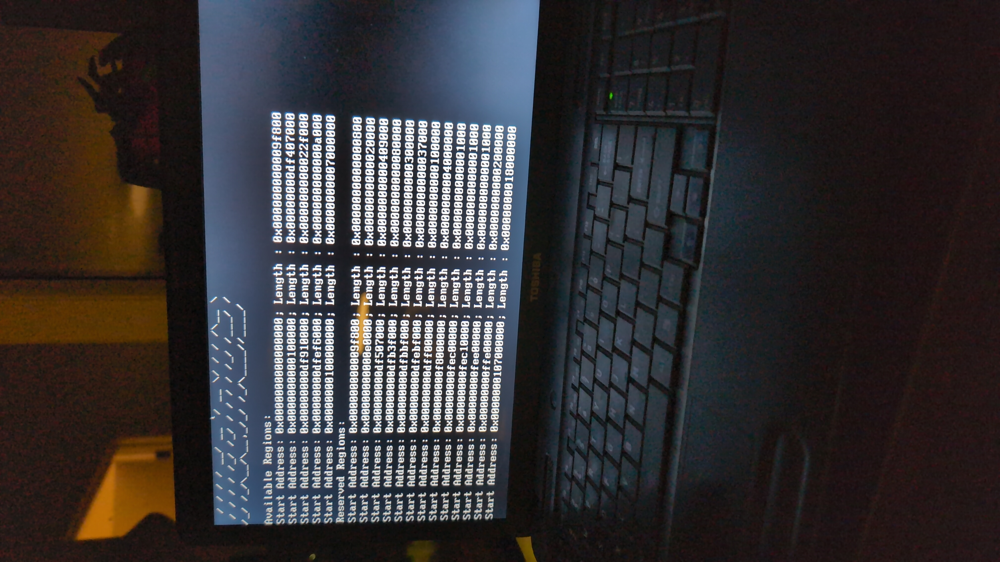

# TitanOS

Another hobby OS written in C for x86-64.

Most of the design was insipred from the book Osdev-Notes and different hobby and production kernels out on the internet

## Dependencies
* GNU Make
* Clang
* GNU Assembler
* GRUB 2.2 (If not using the built-in bootloader)

## Building and Running

For running this with the built-in bootloader, simply run: 
`make`

For running this with GRUB (recommended), simply run
`make grub-run`

## Contributing
Any contributions are welcome. Just create a PR or an issue. 